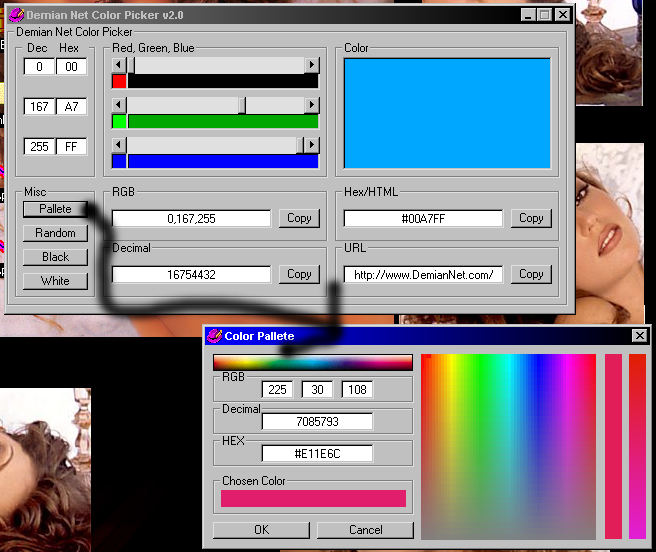



## ULTIMATE Color Chooser

### Description

Let you choose a color via horizontal scroll bars for each Red Green and Blue while showing how much of each you are selecting in picture boxes & showing the decimal & hex values for each red, green and blue & in a big picture box it shows the color of all 3 mixed. Also shows the RGB number value together, the long decimal & the full hex value in a locked text box (has a copy button). Has buttons to automatically set black & white & also to choose a random color. The pallete is a color bar which you can see what color your over when your mouse is over it & same with a color box, when you click in it, it will set the color as the chosen color & will set a fade in a picture box using all the color that use the first 4 out of 6 chars in the hex value & you can choose colors from that too. Check out the screen shot. Also saves the color and the position of the form on the screen to the registry for the next time that the program is loaded.
 
### More Info
 

             |
---                |---
**Submitted On**   |2000-11-05 22:01:04
**By**             |[Max Demian](https://github.com/Planet-Source-Code/PSCIndex/blob/master/ByAuthor/max-demian.md)
**Level**          |Advanced
**User Rating**    |4.0 (8 globes from 2 users)
**Compatibility**  |VB 5\.0, VB 6\.0
**Category**       |[Complete Applications](https://github.com/Planet-Source-Code/PSCIndex/blob/master/ByCategory/complete-applications__1-27.md)
**World**          |[Visual Basic](https://github.com/Planet-Source-Code/PSCIndex/blob/master/ByWorld/visual-basic.md)
**Archive File**   |[CODE\_UPLOAD113561162000\.zip](https://github.com/Planet-Source-Code/max-demian-ultimate-color-chooser__1-12568/archive/master.zip)

